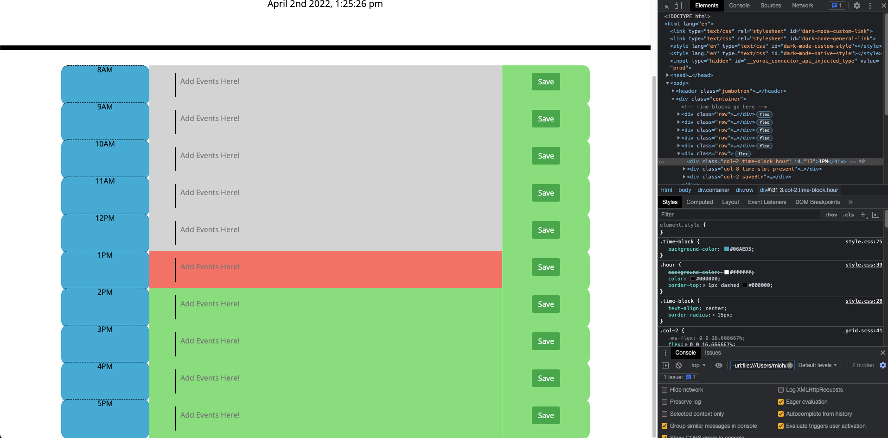

AS AN employee with a busy schedule
I WANT to add important events to a daily planner
SO THAT I can manage my time effectively
GIVEN I am using a daily planner to create a schedule
WHEN I open the planner
THEN the current day is displayed at the top of the calendar
WHEN I scroll down
THEN I am presented with time blocks for standard business hours
WHEN I view the time blocks for that day
THEN each time block is color-coded to indicate whether it is in the past, present, or future
WHEN I click into a time block
THEN I can enter an event
WHEN I click the save button for that time block
THEN the text for that event is saved in local storage
WHEN I refresh the page
THEN the saved events persist

This is a work day scheduler that adapts to the time using moment.js 

The application can automatically tell what time it is within the user's time zone on open, and saves events that the user
enters to local storage

The below image shows the current time on pc at the time of posting and that 1pm was correctly attributed the "present" class by the script
